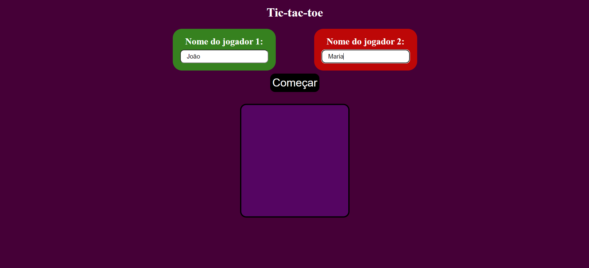

# 🚀 Jogo da velha utilizando DOM

## 🔗 Resultado

Um jogo da velha totalmente funcional com turno entre os jogadores.
Feito paa jogar localmente.

## 📝 Descrição

Esse projeto foi realizado como proposta de exercício do curso OneBitCode para exercitar o principalmente o DOM. Eu aproveitei para aplicar um design simples na página.

Obs.: Tem algum tempo que fiz esse projeto e percebo que ele possui muitos pontos de melhoria, porém decidi publica-lo mesmo assim pois pode servir como inspiração, tanto para outros iniciantes quanto para mim mesmo, conforme minha evolução for acontecendo.

## 💻 Tecnologias

- HTML: Estruturação do projeto.
- CSS: Estilização.
- JavaSrcipt (puro): Manipulação dos elementos em tela (DOM).

<!-- Modelo de README no repositório de Mariana Antonia (https://github.com/mariana549)-->